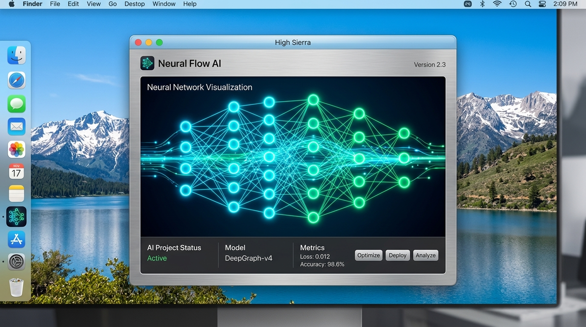

#  fpi HighSierra AI Studio

<div align="center">



<p align="center">
  <strong>An authentic, high-performance macOS 10.13 High Sierra desktop AI workstation client engineered for hybrid cloud & local GGUF neural models.</strong>
</p>

<p align="center">
  
  
  
  
  
</p>

</div>

---

## 📑 Table of Contents

- [🌟 Overview & Architecture](#-overview--architecture)
- [✨ Key Features](#-key-features)
  - [⚡ Dual Cloud & Local Neural Inference](#-dual-cloud--local-neural-inference)
  - [🎨 Authentic macOS High Sierra Desktop Experience](#-authentic-macos-high-sierra-desktop-experience)
  - [🎛️ Metal 2 Hardware Offload & Telemetry](#️-metal-2-hardware-offload--telemetry)
  - [🎭 System Prompt & Persona Studio](#-system-prompt--persona-studio)
  - [💻 HighSierra Terminal Shell & Script Runner](#-highsierra-terminal-shell--script-runner)
  - [💾 APFS Local Storage & Session Vault](#-apfs-local-storage--session-vault)
- [🛠️ Technologies Used](#️-technologies-used)
- [🚀 Getting Started](#-getting-started)
  - [📋 Prerequisites](#-prerequisites)
  - [⚙️ Environment Variables Setup](#️-environment-variables-setup)
  - [📦 Local Development Run](#-local-development-run)
- [💿 Native macOS Installation](#-native-macos-installation)
  - [📦 Method 1: Interactive GUI Package Installer](#-method-1-interactive-gui-package-installer)
  - [🐚 Method 2: HighSierra Native Shell Command Launcher](#-method-2-highsierra-native-shell-command-launcher)
- [🦙 Configuring Local GGUF Models (Ollama & LM Studio)](#-configuring-local-gguf-models-ollama--lm-studio)
- [📁 Project Structure](#-project-structure)
- [🔒 Security & Privacy](#-security--privacy)
- [📜 License & Credits](#-license--credits)

---

## 🌟 Overview & Architecture

**fpi HighSierra AI Studio** brings modern generative intelligence and quantized local language models to life inside the nostalgic, brushed-metal Aqua desktop of **macOS 10.13 High Sierra**.

Built from the ground up to respect classic Intel Core i7 architectures and Metal 2 graphics pipelines while leveraging contemporary server-side **Google Gemini 3.6 Flash / 3.1 Pro APIs** and offline **Ollama / LM Studio GGUF endpoints**, HighSierra AI Studio delivers an uncompromising workstation experience for developers, sysadmins, writers, and AI enthusiasts.

```
┌────────────────────────────────────────────────────────────────────────┐
│                     fpi HighSierra AI Studio (10.13.6)               │
├────────────────────────────────┬───────────────────────────────────────┤
│    🌐 Cloud Intelligence       │       🖥️ Local On-Device AI            │
│  • Google Gemini 3.6 Flash     │  • Ollama (localhost:11434)           │
│  • Google Gemini 3.1 Pro       │  • LM Studio (localhost:1234)         │
│  • Multimodal Vision (Images)  │  • Llama 3 8B, DeepSeek R1 7B, Mistral│
│  • Deep Reasoning CoT Streams  │  • Metal 2 GPU & CPU Thread Offload   │
├────────────────────────────────┴───────────────────────────────────────┤
│  💾 APFS Vault (Encrypted Local Storage) | 🔊 Web Audio Retro Chimes  │
│  🎛️ Live Parameter Inspector (Temp/Top-P) | 📊 Activity Monitor (VRAM)│
└────────────────────────────────────────────────────────────────────────┘
```

---

## ✨ Key Features

### ⚡ Dual Cloud & Local Neural Inference
* **Cloud Power via Google Gemini**: Server-side proxy integration utilizing `@google/genai` with `gemini-2.5-flash` and `gemini-2.5-pro` (or preview 3.6/3.1 series) keeping API credentials strictly guarded on the backend.
* **Local GGUF Model Hub**: Zero-cloud privacy mode targeting local Ollama or LM Studio servers for offline execution of **Llama 3 8B**, **DeepSeek R1 7B**, **Qwen 2.5 7B Coder**, **Mistral 7B**, and **Phi-3 Mini**.
* **Metal 2 Offline Simulation Fallback**: Built-in deterministic simulation engine guaranteeing full testing capability even on offline machines.

### 🎨 Authentic macOS High Sierra Desktop Experience
* **Brushed Metal & Aqua Window Chrome**: Realistic traffic light controls (Close ✕, Minimize –, Zoom +), textured headers, segmented toolbar tabs, and button bevels.
* **Apple Menu Bar**: Interactive top menu bar featuring *About HighSierra AI Studio*, *System Preferences*, *Activity Monitor*, live CPU/VRAM meters, Siri trigger, and status clock.
* **Retro System Audio**: Web Audio API synthesized Macintosh startup chord, send/receive whooshes, click feedbacks, and error alerts.
* **Dynamic Wallpapers**: Switch seamlessly between *High Sierra Alpine Lake*, *Sierra Sunset*, *Alpine Snow*, *Yosemite Granite*, and *Deep Space Dark*.

### 🎛️ Metal 2 Hardware Offload & Telemetry
* **Offloading Controls**: Granular sliders to allocate up to 16 GB of Metal 2 VRAM tensor offloading and 1 to 16 CPU execution threads.
* **Real-time Activity Monitor**: Animated SVG telemetry graphs tracking inference speed (`tokens/sec`), total tokens processed, CPU temperature, and memory consumption.
* **Parameter Inspector**: On-the-fly tuning for Temperature (`0.0` precise to `2.0` creative) and Top-P nucleus sampling (`0.05` to `1.0`).

### 🎭 System Prompt & Persona Studio
* **Built-in Expert Personas**:
  * 💻 **macOS High Sierra Genius**: APFS filesystem, HFS+ migration, kext extensions, and Metal 2 graphics specialist.
  * ⚡ **UNIX Shell Wizard**: Bash, zsh, awk, sed, and launchd automation engineer.
  * 🏗️ **Senior Full-Stack Architect**: TypeScript, Node.js, Express, React, and system design expert.
  * 🧠 **Deep Reasoning Engine**: Step-by-step mathematical logic and chain-of-thought analysis.
  * ✍️ **Creative Wordsmith**: Engaging copywriter and technical author.
* **Custom Persona Creator**: Save, edit, and export personalized system prompts with custom avatars, descriptions, and default temperature profiles.

### 💻 HighSierra Terminal Shell & Script Runner
* **Interactive 80x24 Terminal Drawer**: Directly run generated bash, python, or javascript snippets from chat bubbles into a retro Darwin kernel terminal emulator (`Darwin 17.7.0 x86_64`).
* **One-Click Script Copying**: Code syntax highlighting with instant clip-to-clipboard functionality.

### 💾 APFS Local Storage & Session Vault
* **Local Persistence**: Instant autosave of chat sessions, system preferences, hardware tuning parameters, and custom personas to browser APFS storage.
* **JSON Export & Import**: Backup, share, and restore conversation histories and configuration profiles with zero cloud lock-in.

---

## 🛠️ Technologies Used

| Layer | Technology | Purpose |
|---|---|---|
| **Frontend Framework** | `React 19` + `TypeScript 5.8` | Component architecture & strict type safety |
| **Styling Engine** | `Tailwind CSS 4.1` + `Vite` | Native macOS brushed-metal styling & theme engine |
| **Animation & Transitions** | `motion/react` | Smooth window transitions & modal animations |
| **Backend Server** | `Express 4.21` + `tsx` / `esbuild` | Secure API proxy & development middleware mode |
| **AI Cloud Integration** | `@google/genai` | Google Gemini multimodal LLM inference |
| **Local LLM Protocol** | `REST / OpenAI-compatible API` | Ollama (`11434`) & LM Studio (`1234`) bridge |
| **Markdown & Code** | `react-markdown` + `remark-gfm` | Formatted AI output with syntax-highlighted code blocks |
| **Vector Icons** | `lucide-react` + Material Symbols | Desktop and toolbar system icon glyphs |
| **Audio Engine** | `HTML5 Web Audio API` | Pure synthesized retro macOS sound effects |

---

## 🚀 Getting Started

### 📋 Prerequisites

* **Node.js**: `v16.20.2` or newer (fully compatible with modern Node `18.x`, `20.x`, `22.x`)
* **Package Manager**: `npm` (`v8.19.4`+), `pnpm`, or `bun`
* **Browser**: Chrome 115+, Safari 14+, Firefox 110+, or Edge
* *(Optional)* **Ollama / LM Studio**: If running local GGUF models on your machine

---

### ⚙️ Environment Variables Setup

Create a `.env` file in the root directory (based on `.env.example`):

```bash
# Copy template
cp .env.example .env
```

Add your Gemini API key:

```env
# Server-side Google Gemini API Key
GEMINI_API_KEY=your_google_gemini_api_key_here
```

> 🔒 **Security Notice**: `GEMINI_API_KEY` is loaded exclusively inside `server.ts` on the Express backend and is **never** sent to or exposed in client browser bundles.

---

### 📦 Local Development Run

1. **Clone the repository**:
   ```bash
   git clone https://github.com/zeluisfp/highsierra-ai-studio.git
   cd highsierra-ai-studio
   ```

2. **Install dependencies**:
   ```bash
   npm install
   ```

3. **Start the development server**:
   ```bash
   npm run dev
   ```

4. **Open in browser**:
   Navigate to [http://localhost:3000](http://localhost:3000) to access the desktop workspace.

5. **Build for production**:
   ```bash
   npm run build
   npm start
   ```

---

## 💿 Native macOS Installation

You can run HighSierra AI Studio as a standalone desktop application on macOS 10.13 High Sierra and modern macOS versions.

### 📦 Method 1: Interactive GUI Package Installer

1. Open **fpi HighSierra AI Studio** in your browser.
2. Click the ** Apple Menu** in the top left corner.
3. Select **Install as Native App...** to open the High Sierra Installation Wizard.
4. Follow the steps through destination selection (`Macintosh HD`), volume check, and click **Install**.
5. Once completed, click **Download Native App Launcher (.command)**.

---

### 🐚 Method 2: HighSierra Native Shell Command Launcher

You can install the `.app` bundle directly via the Terminal:

```bash
cat << 'EOF' > ~/Desktop/Install_HighSierra_AI_Studio.command
#!/bin/bash
APP_DIR="/Applications/HighSierra AI Studio.app"
mkdir -p "$APP_DIR/Contents/MacOS"
mkdir -p "$APP_DIR/Contents/Resources"

cat << 'PLIST' > "$APP_DIR/Contents/Info.plist"
<?xml version="1.0" encoding="UTF-8"?>
<!DOCTYPE plist PUBLIC "-//Apple//DTD PLIST 1.0//EN" "http://www.apple.com/DTDs/PropertyList-1.0.dtd">
<plist version="1.0">
<dict>
    <key>CFBundleExecutable</key>
    <string>HighSierraAI</string>
    <key>CFBundleIdentifier</key>
    <string>com.highsierra.aistudio</string>
    <key>CFBundleName</key>
    <string>HighSierra AI Studio</string>
    <key>CFBundlePackageType</key>
    <string>APPL</string>
    <key>CFBundleShortVersionString</key>
    <string>10.13.6</string>
    <key>LSMinimumSystemVersion</key>
    <string>10.13.0</string>
</dict>
</plist>
PLIST

cat << 'LAUNCHER' > "$APP_DIR/Contents/MacOS/HighSierraAI"
#!/bin/bash
echo "[HighSierra AI Studio] Launching standalone desktop client..."
open "http://localhost:3000"
LAUNCHER

chmod +x "$APP_DIR/Contents/MacOS/HighSierraAI"
chmod +x "$APP_DIR"
echo "✅ Installed to /Applications/HighSierra AI Studio.app"
open "$APP_DIR"
EOF

chmod +x ~/Desktop/Install_HighSierra_AI_Studio.command
~/Desktop/Install_HighSierra_AI_Studio.command
```

---

## 🦙 Configuring Local GGUF Models (Ollama & LM Studio)

HighSierra AI Studio communicates directly with local model servers:

### 1. Using Ollama (`http://localhost:11434`)
1. Install [Ollama](https://ollama.com) on your Mac / PC.
2. Pull your desired models in Terminal:
   ```bash
   ollama pull llama3:8b
   ollama pull deepseek-r1:7b
   ollama pull qwen2.5-coder:7b
   ollama pull mistral:7b
   ```
3. In **HighSierra AI Studio**, switch to the **Local Hub** tab.
4. Select **Ollama Server** (`http://localhost:11434`) and click **Test Connection**.

### 2. Using LM Studio (`http://localhost:1234`)
1. Download [LM Studio](https://lmstudio.ai).
2. Download any GGUF model and start the **Local Inference Server** on port `1234`.
3. In HighSierra AI Studio, select **LM Studio OpenAI Server** and test the endpoint.

---

## 📁 Project Structure

```
├── .env.example                     # Environment variables specification
├── package.json                     # Dependencies, scripts, and build pipeline
├── server.ts                        # Full-stack Express server + Gemini AI proxy
├── vite.config.ts                   # Vite configuration & Tailwind plugin
├── tsconfig.json                    # TypeScript strict compiler options
├── metadata.json                    # Application capabilities & metadata
├── src/
│   ├── main.tsx                     # React client bootstrap entry point
│   ├── App.tsx                      # Main High Sierra desktop workspace controller
│   ├── index.css                    # Brushed-metal, Aqua, & traffic-light styles
│   ├── types.ts                     # TypeScript data contracts & models
│   ├── assets/
│   │   └── images/                  # Generated hero banners & desktop wallpapers
│   ├── data/
│   │   └── defaults.ts              # Default models, personas, and telemetry state
│   ├── lib/
│   │   └── sound.ts                 # Web Audio API retro Macintosh sound synthesizer
│   └── components/
│       ├── MenuBar.tsx              # Top Apple Menu Bar with system gauges & clock
│       ├── WindowChrome.tsx         # Brushed metal titlebar & traffic lights
│       ├── ChatWorkspace.tsx        # Multimodal chat stream with code runners
│       ├── LocalHubDrawer.tsx       # Ollama / LM Studio connection & Metal 2 tuning
│       ├── InspectorDrawer.tsx      # Temperature & Top-P parameter slider drawer
│       ├── TerminalShellDrawer.tsx  # Darwin 80x24 interactive terminal shell
│       ├── PersonaStudioModal.tsx   # Custom system prompt & persona manager
│       ├── ActivityMonitorModal.tsx # Real-time telemetry, VRAM, and tok/s graphs
│       ├── AboutMacModal.tsx        # Authentic "About This Mac" system dialog
│       ├── SystemPreferencesModal.tsx # Preferences (wallpapers, sounds, auto-TTS)
│       └── InstallerModal.tsx       # macOS .pkg style native application installer
```

---

## 🔒 Security & Privacy

* **Zero-Leak Server Architecture**: All Google Gemini API credentials remain strictly on the Express backend (`server.ts`). Client browsers only receive serialized text streams.
* **100% Offline Capability**: When using the Local Hub with Ollama / LM Studio, prompts and weights never leave your local machine or local network.
* **Client-Side APFS Persistence**: Chat histories and customized personas reside entirely in your browser's private local vault.

---

## 📜 License & Credits

* **Designed & Engineered for**: macOS 10.13 High Sierra enthusiasts & modern AI developers.
* **Powered by**: Google Gemini, Ollama, React, and Tailwind CSS.
* **License**: MIT License. Feel free to use, modify, and build upon this project.

<div align="center">
  <p><sub>Crafted with precision for macOS High Sierra 10.13.6</sub></p>
</div>
